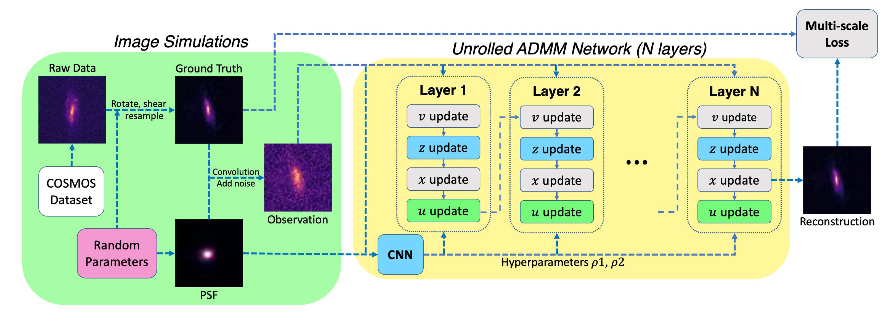
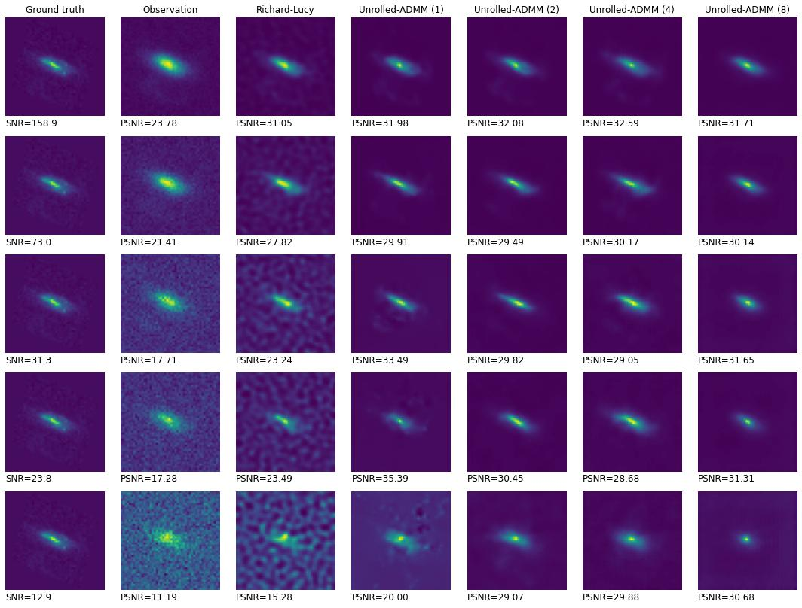

# Galaxy Image Deconvolution for Weak Gravitational Lensing with Physics-informed Deep Learning
[Tianao Li](https://lukeli0425.github.io)<sup>1</sup>, [Emma Alexander](https://www.alexander.vision/emma)<sup>2</sup><br>
<sup>1</sup>Tsinghua University, <sup>2</sup>Northwestern University<br>
_In submission_

Code for [_Galaxy Image Deconvolution for Weak Gravitational Lensing with Physics-informed Deep Learning_](https://arxiv.org/abs/2211.01567).



<!--  -->

---

## Running the Project

To clone this project, run:
```zsh
git clone https://github.com/Lukeli0425/Galaxy-Deconv.git
```

Create a virtual environment and download the required packages, by running:
```zsh
pip install -r requirements.txt
```

Download our simulated [galaxy dataset](https://drive.google.com/drive/folders/1IwgvbetMDpLK2skRalYWmth2J1gvF-qm) from Google Drive.

To train to model, run [`train.py`](train.py), where you can choose the number of iterations and whether to load pretrained weights, for instance:
```zsh
python train.py --n_epochs 100 --n_iters 4 --load_pretrain
```

Test the algorithms from the perspectives of time and performance with [`test.py`](test.py). You can specify the number of galaxies you want to use in the test dataset:
```zsh
python test.py --n_gal 5000
```

Test the robustness of the algorithms to systematic errors in PSF with [`test_psf.py`](test_psf.py). Similarly, you can set the number of galaxies you want to use:
```zsh
python test_psf.py --n_gal 5000
```
All the test results will be automatically saved in the [`results`](results) folder.

## Using the model on your own data

We provide a tutorial for using the suggested model on your data, see [`tutorial/deconv.ipynb`](tutorial/deconv.ipynb) for details. 


## Simulating your own dataset

We simulated our dataset with the modular galaxy image simulation toolkit [Galsim](https://github.com/GalSim-developers/GalSim) and the [COSMOS Real Galaxy Dataset](https://zenodo.org/record/3242143#.Ytjzki-KFAY). To create your own dataset, one need to first download the COSMOS data (or use your own data).

Create a `data` folder and download COSMOS dataset:
```zsh
mkdir data
cd data
wget https://zenodo.org/record/3242143/files/COSMOS_23.5_training_sample.tar.gz
wget https://zenodo.org/record/3242143/files/COSMOS_25.2_training_sample.tar.gz
```

Unzip the downloaded files:
```zsh
tar zxvf COSMOS_23.5_training_sample.tar.gz
tar zxvf COSMOS_25.2_training_sample.tar.gz
```

Run [`dataset.py`](dataset.py) to simulate your own dataset under different settings:
```python
python dataset.py
```
We also provide a detailed tutorial for image simulation (see [`tutorials/image_simulation.ipynb`](tutorials/image_simulation.ipynb)), where you can find out how to set your own parameters.


## Retraining on simulated data

If you want to train the model with your own dataset, you can either train it from scratch or use our saved model ([`saved_models`](saved_models)) and train with a transfer learning manner. 


## Recreating our figures

The [`figures`](figures) folder holds the figures in the paper and the files that created them (see [`figures/README.md`](figures/README.md)). To recreate the figures with your own results, you can use the given files and follow the instructions we provide.

## Citation
```bibtex
@misc{https://doi.org/10.48550/arxiv.2211.01567,
    doi = {10.48550/ARXIV.2211.01567},
    url = {https://arxiv.org/abs/2211.01567},
    author = {Li, Tianao and Alexander, Emma},
    keywords = {Instrumentation and Methods for Astrophysics (astro-ph.IM), Computer Vision and Pattern Recognition (cs.CV), FOS: Physical sciences, FOS: Physical sciences, FOS: Computer and information sciences, FOS: Computer and information sciences},
    title = {Galaxy Image Deconvolution for Weak Gravitational Lensing with Physics-informed Deep Learning},
    publisher = {arXiv},
    year = {2022},
    copyright = {arXiv.org perpetual, non-exclusive license}
}
```
