# Adaptive transform for manifold-valued data

This package contains all software developed as part of Workpackage 2.1 (Adaptive transform for manifold-valued data)
of the DEDALE project. For an in-depth description of this workpackage, we refer to the associated technical report.

The software consists of three main parts:

1. An implementation of the (bandlimited) **α-shearlet transform** (in [AlphaTransform.py](../AlphaTransform.py),
   in three versions:
   * A *fully sampled* (non-decimated), translation invariant, fast, but memory-*consuming* implementation
   * A fully sampled, translation invariant, slightly slower, but memory-*efficient* implementation
   * A *subsampled* (decimated), *not* translation invariant, but fast and memory-efficient implementation.
2. Implementations (in [AdaptiveAlpha.py](../AdaptiveAlpha.py)) of three criteria that can be used to adaptively choose
   the value of α, namely:
   * The [*asymptotic approximation rate*](#aar) (**AAR**),
   * the [*mean approximation error*](#mae) (**MAE**),
   * the [*thresholding denoising performance*](#tdp) (**TDP**).
3. A [chart-based implementation](#sphere-valued) (in [SphereTransform.py](../SphereTransform.py)) of the α-shearlet transform for
   functions defined on the sphere.


In the following, we provide brief explanations and hands-on experiments for all of these aspects. The following
table of content can be used for easy navigation:

## Table of Contents
1. [The α-shearlet transform: A crash course](#shearlet-trafo-crash-course)

2. [Adaptively choosing α](#adaptivity)

     a) [Asymptotic approximation rate (AAR)](#aar)

     b) [Mean approximation error (MAE)](#mae)

     c) [Thresholding denoising performance (TDP)](#tdp)

3. [The α-shearlet transform for functions defined on the sphere](#sphere-valued)


## <a name="shearlet-trafo-crash-course"></a>The α-shearlet transform: A crash course

The following demonstrates a very simple use case of the α-shearlet transform: We compute the transform of an example image,
threshold the coefficients, reconstruct and compute the error. The code is longer than strictly necessary, since
along the way give a demonstration of the general usage of the transform.

```python
>>> # Importing necessary packages
>>> from AlphaTransform import AlphaShearletTransform as AST
>>> import numpy as np
>>> import matplotlib.pyplot as plt
>>> from scipy import misc

>>> im = misc.face(gray=True)
>>> im.shape
(768, 1024)

>>> # Setting up the transform
>>> trafo = AST(im.shape[1], im.shape[0], [0.5]*3) # 1
Precomputing shearlet system: 100%|███████████████████████████████████████| 52/52 [00:05<00:00,  8.83it/s]

>>> # Computing and understanding the α-shearlet coefficients
>>> coeff = trafo.transform(im) # 2
>>> coeff.shape # 3
(53, 768, 1024)
>>> trafo.indices # 4
[-1,
 (0, -1, 'r'), (0, 0, 'r'), (0, 1, 'r'),
 (0, 1, 't'), (0, 0, 't'), (0, -1, 't'),
 (0, -1, 'l'), (0, 0, 'l'), (0, 1, 'l'),
 (0, 1, 'b'), (0, 0, 'b'), (0, -1, 'b'),
 (1, -2, 'r'), (1, -1, 'r'), (1, 0, 'r'), (1, 1, 'r'), (1, 2, 'r'),
 (1, 2, 't'), (1, 1, 't'), (1, 0, 't'), (1, -1, 't'), (1, -2, 't'),
 (1, -2, 'l'), (1, -1, 'l'), (1, 0, 'l'), (1, 1, 'l'), (1, 2, 'l'),
 (1, 2, 'b'), (1, 1, 'b'), (1, 0, 'b'), (1, -1, 'b'), (1, -2, 'b'),
 (2, -2, 'r'), (2, -1, 'r'), (2, 0, 'r'), (2, 1, 'r'), (2, 2, 'r'),
 (2, 2, 't'), (2, 1, 't'), (2, 0, 't'), (2, -1, 't'), (2, -2, 't'),
 (2, -2, 'l'), (2, -1, 'l'), (2, 0, 'l'), (2, 1, 'l'), (2, 2, 'l'),
 (2, 2, 'b'), (2, 1, 'b'), (2, 0, 'b'), (2, -1, 'b'), (2, -2, 'b')]

>>> # Thresholding the coefficients and reconstructing
>>> np.max(np.abs(coeff)) # 5
2041.1017181588547
>>> np.sum(np.abs(coeff) > 200) / coeff.size # 6
0.020679905729473761
>>> thresh_coeff = coeff * (np.abs(coeff) > 200) # 7
>>> recon = trafo.inverse_transform(thresh_coeff, real=True) # 8
>>> np.linalg.norm(im - recon) / np.linalg.norm(im) # 9
0.13912540983541383

>>> plt.imshow(recon, cmap='gray')
<matplotlib.image.AxesImage object at 0x2b0f568c25c0>
>>> plt.show()
```

### Importing necessary packages

The first few (unnumbered) lines import relevant packages and load (a gray scale version of) the following
test image, which has a resolution of 1024 x 768 pixels:
<p align="center">

</p>


### Setting up the transform

Then, in line 1, we create an instance `trafo` of the class `AlphaShearletTransform` (which is
called `AST` above for brevity).
During construction of this object, the necessary shearlet filters are precomputed. This may take some time
(5 seconds in the example above), but speeds up later computations.

The three parameters passed to the constructor of `trafo` require some explanation:
* The first parameter is the *width* of the images which can be analyzed using the `trafo` object.
* Similarly, the second parameter determines the *height*.
* The third parameter is of the form `[alpha] * N`, where `N` determines the number of scales of the transform and `alpha`
  determines the value of α.
  
  The reason for this notation is that in principle, one can choose a
  different value of α on each scale. Since `[0.5] * 3 = [0.5, 0.5, 0.5]`, one can use this notation to obtain a
  system using a single value of α across all scales.

All in all, we see that line 1 creates a shearlet system (i.e., α = 0.5) with 3 scale (plus a low-pass)
for images of dimension 1024 x 768.

### Computing and understanding the α-shearlet coefficients

Line 2 shows that the α-shearlet coefficients of the image `im` can be readily computed using the `transform` method of `trafo`.
As seen in line 3, this results in an array of size `53`, where each of the elements of the array is an array (an image) of
size 1024 x 768, i.e., of the same size as the input image.

To help understand the meaning of each of these **coefficient images** `coeff[i]`, for `i = 0, ..., 52`, the output of line 4
is helpful: Associated to each coefficient image `coeff[i]`, there is an **index** `trafo.indices[i]` which encodes the *meaning*
of the coefficient image, i.e., the shearlet used to compute it.

The special index `-1` stands for the **low-pass part**. All other indices are of the form `(j, k, c)`, where
* `j` encodes the **scale**. In the present case, `j` ranges from `0` to `2`, since we have 3 scales.
* `k` encodes the **amount of shearing**, ranging from -⌈2<sup>j(1 - α)</sup>⌉ to ⌈2<sup>j(1 - α)</sup>⌉ on scale ``j``.
* `c` encodes the **cone** to which the shearlet belongs (in the Fourier domain). Precisely, we have the following correspondence
  between the value of `c` and the corresponding frequency cones:

  | value of `c`   | `'r'` | `'t'` | `'l'` | `'b'`  |
  | -------------- |:-----:|:-----:|:-----:|:------:|
  | Frequency cone | right |  top  | left  | bottom |


Note that if we divide the frequency plane into four cones, such that each shearlet has a real-valued Fourier transform
which is supported in one of these cones, then the shearlets themselves (i.e., in space) *can not* be real-valued.
Hence, if real-valued shearlets are desired, one can pass the constructor of the class `AlphaShearletTransform` the
additional argument `real=True`. In this case, the frequency plane is split into a horizontal (encoded by `'h'`) and
a vertical (encoded by `'v'`) cone, as is indicated by the following example:
```python
>>> trafo_real = AST(im.shape[1], im.shape[0], [0.5]*3, real=True)
Precomputing shearlet system: 100%|██████████████████████████████████████| 26/26 [00:03<00:00,  5.62it/s]
>>> trafo_real.indices
[-1,
 (0, -1, 'h'), (0, 0, 'h'), (0, 1, 'h'),
 (0, 1, 'v'), (0, 0, 'v'), (0, -1, 'v'),
 (1, -2, 'h'), (1, -1, 'h'), (1, 0, 'h'), (1, 1, 'h'), (1, 2, 'h'),
 (1, 2, 'v'), (1, 1, 'v'), (1, 0, 'v'), (1, -1, 'v'), (1, -2, 'v'),
 (2, -2, 'h'), (2, -1, 'h'), (2, 0, 'h'), (2, 1, 'h'), (2, 2, 'h'),
 (2, 2, 'v'), (2, 1, 'v'), (2, 0, 'v'), (2, -1, 'v'), (2, -2, 'v')]
```

### Thresholding the coefficients & reconstructing

When called without further parameters, the method `trafo.transform` computes a *normalized* transform,
so that effectively all shearlets are normalized to have L² norm 1. With this normalization, line 5 shows
that the largest coefficient has size about 2041. We now (arbitrarily) pick a threshold of 200 and see (in line 6)
that only about 2% of the coefficients are larger than this threshold. Next, we set all coefficients which are smaller
(in absolute value) than 200 to zero and save the resulting thresholded coefficients as `thresh_coeff`, in line 7.

In line 8, we then use the method `inverse_transform` of the `trafo` object to compute the inverse transform.
Since we know that the original image was real-valued, we pass the additional argument `real=True`.
This has the same effect as reconstructing without this additional argument and then taking the real part.
Line 9 shows that the relative error is about 13.9%.

Finally, the last two lines display the reconstructed image.

### Changes for the subsampled transform

Above, we showed how our implementation of the *fully sampled* α-shearlet transform can be used to compute the α-shearlet
transform of an image and reconstruct (with thresholded coefficients). For the *subsampled* transform, this can be
done very similarly; the main difference one has to keep in mind is that for the fully sampled transform,
one obtains an array of "coefficient images" which are all of the same size. In contrast, due to the subsampling,
the "coefficient images" for the subsampled transform are all of different sizes:

```python
>>> from AlphaTransform import AlphaShearletTransform as AST
>>> import matplotlib.pyplot as plt
>>> import numpy as np
>>> from scipy import misc

>>> im = misc.face(gray=True)
>>> trafo = AST(im.shape[1], im.shape[0], [0.5]*3, subsampled=True) # 1
Precomputing shearlets: 100%|████████████████████████████████████████████| 52/52 [00:00<00:00, 69.87it/s]
>>> coeff = trafo.transform(im) # 2

>>> type(coeff).__name__ # 3
'list'
>>> [c.shape for c in coeff] # 4
[(129, 129),
 (364, 161), (364, 161), (364, 161),
 (97, 257), (97, 257), (97, 257),
 (364, 161), (364, 161), (364, 161),
 (97, 257), (97, 257), (97, 257),
 (514, 321), (514, 321), (514, 321), (514, 321), (514, 321),
 (193, 364), (193, 364), (193, 364), (193, 364), (193, 364),
 (514, 321), (514, 321), (514, 321), (514, 321), (514, 321),
 (193, 364), (193, 364), (193, 364), (193, 364), (193, 364),
 (727, 641), (727, 641), (727, 641), (727, 641), (727, 641),
 (385, 513), (385, 513), (385, 513), (385, 513), (385, 513),
 (727, 641), (727, 641), (727, 641), (727, 641), (727, 641),
 (385, 513), (385, 513), (385, 513), (385, 513), (385, 513)]

>>> np.max([np.max(np.abs(c)) for c in coeff]) # 5
2031.0471969998314
>>> np.sum([np.sum(np.abs(c) > 200) for c in coeff]) # 6
22357
>>> np.sum([np.sum(np.abs(c) > 200) for c in coeff]) / np.sum([c.size for c in coeff]) # 7
0.0023520267754635542
>>> thresh_coeff = [c * (np.abs(c) > 200) for c in coeff] # 8
>>> recon = trafo.inverse_transform(thresh_coeff, real=True) # 9
>>> np.linalg.norm(im - recon) / np.linalg.norm(im)
0.13945789596375507
```

Up to the first marked line, everything is identical to the code for the fully sampled transform.
The only difference in line 1 is the additional argument `subsampled=True` to obtain a subsampled transform.
Then, in line 2, the transform of the image `im` is computed just as for the fully sampled case.

The main difference to the fully sampled transform becomes visible in lines 3 and 4:
In contrast to the fully sampled transform, where the coefficients are a 3-dimensional numpy *array*,
the subsampled transform yields a *list* of 2-dimensional numpy arrays, with **varying shapes**.
This shape is constant with respect to the shear `k` as long as the scale `j` and the cone `c` are kept fixed,
but varies strongly with `j` and `c`. In face, for a *quadratic* image, the shape would only depend on the scale `j`.

Since we have a list of numpy arrays instead of a single numpy array, all operations on the coefficients are more
cumbersome to write down (using list comprehensions), but are identical in spirit to the case of the fully sampled
transform, cf. lines 5-8.

The actual reconstruction (in line 9) is exactly identical to the fully sampled case. It is interesting to note that
only about 0.24% of the coefficients - and thus much less than the 2% for the fully sampled transform - are larger than
the threshold. Nevertheless, the relative error is essentially the same.

## <a name="adaptivity"></a>Adaptively choosing α

In the following, we show for each of the three optimality criteria ([AAR](#aar), [MAE](#mae) and [TDP](#tdp)) how our
implementation can be used to determine the optimal value of α for a given set of images.

### <a name="aar"></a>Asymptotic approximation rate (AAR)

The following code uses a grid search to determine the value of α which yields the best *asymptotic approximation rate*
(as described in the technical report) for the given set of images:

<a name="aar-session"></a>
```python
>>> from AdaptiveAlpha import optimize_AAR

>>> shearlet_args = {'real' : True, 'verbose' : False} # 1
>>> images = ['./Review/log_dust_test.npy'] # 2
>>> num_scales = 4 # 3
>>> num_alphas = 3 # 4

>>> optimize_AAR(images, num_scales, 1 / (num_alphas - 1), shearlet_args=shearlet_args)
First step: Determine the maximum relevant value...
alpha loop: 100%|████████████████████████████████████████████████████████| 3/3 [00:10<00:00,  3.48s/it]
image loop: 100%|████████████████████████████████████████████████████████| 1/1 [00:01<00:00,  1.60s/it]
Maximum relevant value: 0.04408709120918954

Second step: Computing the approximation errors...
alpha loop: 100%|████████████████████████████████████████████████████████| 3/3 [01:40<00:00, 30.99s/it]
Image loop: 100%|████████████████████████████████████████████████████████| 1/1 [00:46<00:00, 46.89s/it]
Thresh. loop: 100%|██████████████████████████████████████████████████████| 50/50 [00:45<00:00,  1.10it/s]

Third step: Computing the approximation rates...
Common breakpoints: [0, 4, 34, 50]
Last common linear part: [34, 50)

last slopes:
   alpha = 1.00 : -0.161932 + 0.012791
   alpha = 0.50 : -0.161932 + 0.000108
 * alpha = 0.00 : -0.161932 - 0.012900

Optimal value: alpha = 0.00
```
In addition to the output shown above, executing this code will display the following plot:
<p align="center">
<a name="aar-plot"></a>
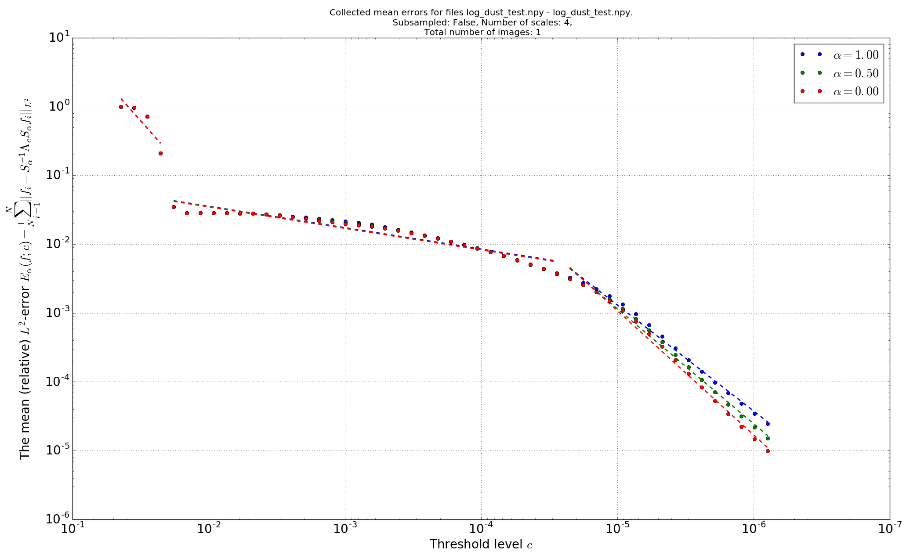
</p>


We now briefly explain the above [code](#aar-session) and output:
In the short program above, we first import the function `optimize_AAR` which will do the actual work.
Then, we define the parameters to be passed to this function:

1. In line 1, we determine the properties of the α-shearlet systems that will be used:
    * `'real': True` ensures that real-valued shearlets are used.
    * `'verbose': False` suppresses some output, e.g. the progress bar for precomputing the shearlet system.

   Another possible option would be `'subsampled': True` if one wants to use the subsampled transform. Note though
   that this is incompatible with the `'real': True` option.

2. In line 2, we determine the set of images that is to be used. To ensure fast computations, we only take
   a single image for this example. Specifically, the used image is the logarithm of one of the 12 faces of cosmic
   dust data provided by CEA, as depicted in the following figure:

   <p align="center">
   <a name="log-dust-image"></a>
   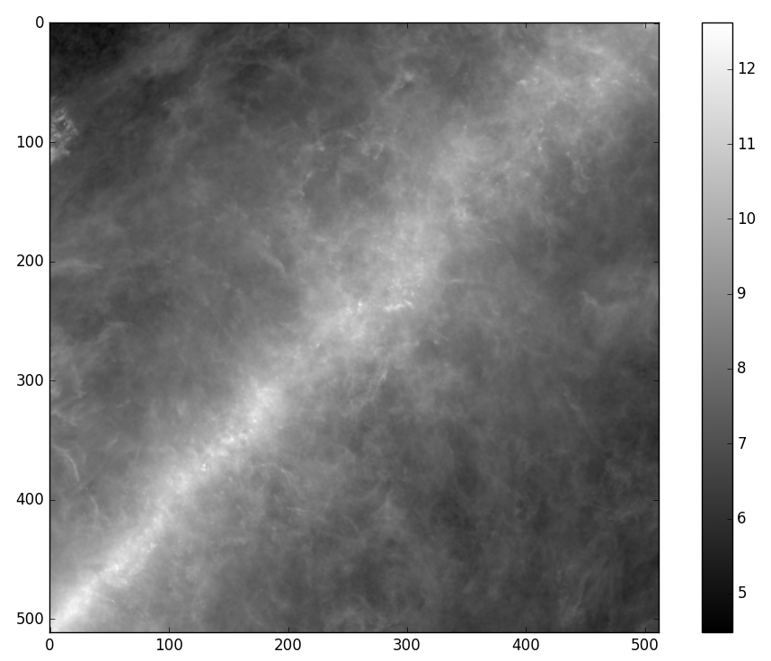
   </p>

3. The variable `num_scales` determines how many scales the α-shearlet systems should use.

4. Since we are using a grid search (i.e., we are only considering finitely many values of α), the
   variable `num_alphas` is used to determine how many different values of α should be distinguished.
   These are then uniformly spread in the interval [0,1]. Again, to ensure fast computations, we only consider
   three different values, namely α=0, α=0.5 and α=1.

Finally, we invoke the function `optimize_AAR` with the chosen parameters. As described in the technical report,
this function does the following:

1. It determines a range [0, c<sub>0</sub>] such that for c≥c<sub>0</sub>, all α-shearlet transforms yield the
   *same error* when all coefficients of absolute value ≤c are set to zero ("thresholded").

2. It computes the reconstruction errors for the different values of α after thresholding the coefficients with
   a threshold of c<sub>0</sub>·b<sup>k</sup> for k=0,...,K-1.
   
   The default value is K=50. This can be adjusted by passing e.g. the argument `num_x_values=40` as an
   additional argument to `optimize_AAR`. Likewise, the base `b` (with default value `b=1.25`) can be adjusted
   by passing e.g. `base=1.3` as a further argument.

3. It determines a partition of {0, ..., K-1} into at most 4 intervals such that on each of these intervals,
   each of the (logarithmic) error curves is almost linear.
   
   In the example run above, the end points of the
   resulting partition are given by `Common breakpoints: [0, 4, 34, 50]`. In this case, the resulting
   partition has only three intervals instead of 4, since on each of these intervals, the best linear approximation
   is already sufficiently good.

4. For each value of α, the function then determines the *slopes* of the (logarithmic) error curve on the
   last of these intervals and compares these slopes.

   The optimal value of α (in this case α=0) is the one with the smallest slope, i.e., with the highest
   decay of the error. To allow for a visual comparison, `optimize_AAR` also displays a [plot](#aar-plot) of the
   (logarithmic) error curves, including the partition into the almost linear parts.

### <a name="mae"></a>Mean approximation error (MAE)

The following code uses a grid search to determine the value of α which yields the best *mean approximation error*
(as described in the technical report) for the given set of images:

<a name="mae-session"></a>
```python
>>> from AdaptiveAlpha import optimize_MAE
>>> shearlet_args = {'real' : True, 'verbose' : False} # 1
>>> images = ['./Review/log_dust_test.npy'] # 2
>>> num_scales = 4
>>> num_alphas = 3
>>> optimize_MAE(images, num_scales, 1 / (num_alphas - 1), shearlet_args=shearlet_args)
First step: Determine the maximum relevant value...
alpha loop: 100%|████████████████████████████████████████████████████████| 3/3 [00:11<00:00,  3.61s/it]
image loop: 100%|████████████████████████████████████████████████████████| 1/1 [00:01<00:00,  1.61s/it]
Maximum relevant value: 0.006053772894213893

Second step: Computing the approximation errors...
alpha loop: 100%|████████████████████████████████████████████████████████| 3/3 [01:40<00:00, 31.13s/it]
image loop: 100%|████████████████████████████████████████████████████████| 1/1 [00:48<00:00, 48.25s/it]
thresholding loop: 100%|█████████████████████████████████████████████████| 50/50 [00:46<00:00,  1.08it/s]

Final step: Computing optimal value of alpha...
mean errors:
   alpha = 1.00 : +0.024105 + 0.000258
   alpha = 0.50 : +0.024105 + 0.000015
 * alpha = 0.00 : +0.024105 - 0.000273

Optimal value: alpha = 0.00
```

In addition to the output shown above, executing this code will display the following plot:
<p align="center">
<a name="mae-plot"></a>
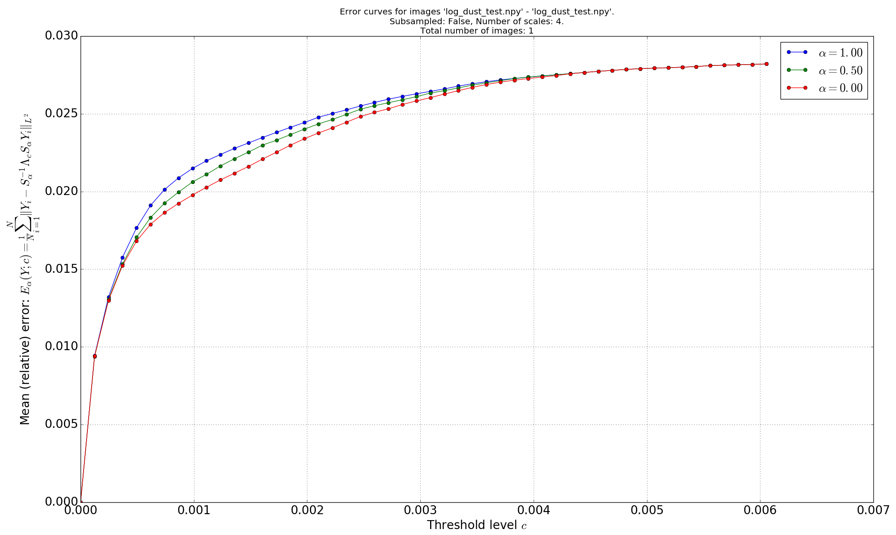
</p>

We now briefly explain the above [code](#mae-session) and output:
In the short program above, we first import the function `optimize_MAE` which will do the actual work.
Then, we define the parameters to be passed to this function:

1. In line 1, we determine the properties of the α-shearlet systems that will be used:
    * `'real': True` ensures that real-valued shearlets are used.
    * `'verbose': False` suppresses some output, e.g. the progress bar for precomputing the shearlet system.

   Another possible option would be `'subsampled': True` if one wants to use the subsampled transform. Note though
   that this is incompatible with the `'real': True` option.

2. In line 2, we determine the set of images that is to be used. To ensure fast computations, we only take
   a single image for this example. Specifically, the used image is the logarithm of one of the 12 faces of cosmic
   dust data provided by CEA, as depicted in the [figure](#log-dust-image) above.

3. The variable `num_scales` determines how many scales the α-shearlet systems should use.

4. Since we are using a grid search (i.e., we are only considering finitely many values of α), the
   variable `num_alphas` is used to determine how many different values of α should be distinguished.
   These are then uniformly spread in the interval [0,1]. Again, to ensure fast computations, we only consider
   three different values, namely α=0, α=0.5 and α=1.

Finally, we invoke the function `optimize_MAE` with the chosen parameters. As described in the technical report,
this function does the following:

1. It determines a range [0, c<sub>0</sub>] such that for c≥c<sub>0</sub>, all α-shearlet transforms yield the
   *same error* when all coefficients of absolute value ≤c are set to zero ("thresholded").

2. It computes the reconstruction errors for the different values of α after thresholding the coefficients with
   a threshold of c = c<sub>0</sub>·i / K for i = 0, ..., K-1.

   The default value is K=50. This can be adjusted by passing e.g. the argument `num_x_values=40` as an additional
   argument to `optimize_MAE`.

3. For each value of α, the function then determines the *mean* of all these approximation errors. The optimal
   value of α (in this case α=0) is the one with the smallest mean approximation error.

   To allow for a visual comparison, `optimize_MAE` also displays a [plot](#mae-plot) of the error curves.


### <a name="tdp"></a>Thresholding Denoising Performance (TDP)

In the following, we show how the denoising performance of an α-shearlet system can be used as an optimality
criterion for adaptively choosing the correct value of α.

Since the [(logarithmic) dust data](#log-dust-image) used for the previous experiments does not allow for an
easy visual comparison between the original image and the different denoised versions, we decided to instead
use the following 684 x 684 cartoon image (taken from [SMBC](http://smbc-comics.com)) as a toy example:
<p align="center">
<a name=cartoon-example></a>
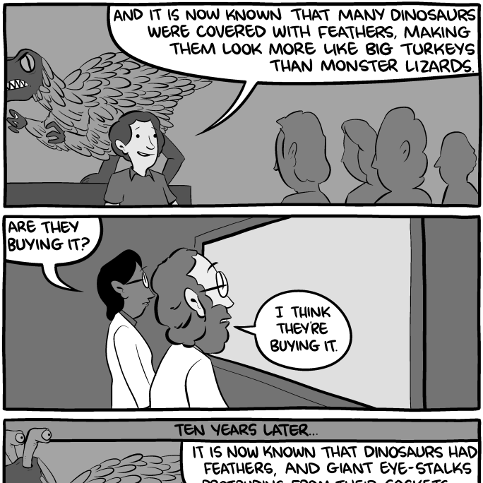
</p>


The following code uses a grid search over different values of α to determine the value with the
optimal denoising performance:
<a name="tdp-session"></a>
```python
>>> from AdaptiveAlpha import optimize_denoising

>>> image_paths=['./Review/cartoon_example.png']       # 1
>>> num_alphas = 3                                     # 2
>>> num_scales = 5                                     # 3
>>> num_noise_levels = 5                               # 4
>>> shearlet_args = {'real' : True, 'verbose' : False} # 5

>>> optimize_denoising(image_paths,
                       num_scales,
                       1 / (num_alphas - 1),
                       num_noise_levels,
                       shearlet_args=shearlet_args)
image loop: 100%|██████████████████████████████████████████████████████████| 1/1 [01:33<00:00, 93.16s/it]
alpha loop: 100%|██████████████████████████████████████████████████████████| 3/3 [01:33<00:00, 28.44s/it]
noise loop: 100%|██████████████████████████████████████████████████████████| 5/5 [00:46<00:00,  9.38s/it]

Averaged error over all images and all noise levels:
alpha = 1.00: 0.0961
alpha = 0.50: 0.0900
alpha = 0.00: 0.0948

Optimal value on whole set: alpha = 0.50
```

In addition to the output shown above, executing the sample code also displays the following plot:
<p align="center">
<a name="tdp-plot"></a>
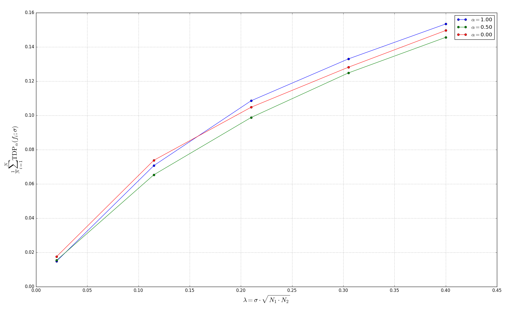
</p>

We now briefly explain the above [code](#tdp-session) and output:
First, we import from `AdaptiveAlpha.py` the function `optimize_denoising` which will do the actual work.
We then set the parameters to this function. In the present case, we want to
* analyze the [cartoon image](#cartoon-example) shown above,
* use α-shearlet transforms with *real-valued* shearlets (cf. line 5, the second part of that line suppresses some output),
* use α-shearlet transforms with 5 scales (line 4),
* use 5 different noise levels λ (line 4) which are uniformly spaced in [0.02, 0.4],
* compare three different values of α, which are uniformly spaced in [0,1], i.e, α=1, α=0.5 and α=0.

In more realistic experiment, one would of course use a larger set of test images and consider more different values of
α, possibly also with a larger number of different noise levels. But here, we are mainly interested in a quick
execution time, so we keep everything small.

Finally, we invoke the function `optimize_denoising` which - briefly summarized - does the following:
1. It normalizes each of the K x K input images to have L² norm equal to 1.
   Then, for each image, each value of α  and each noise level λ in [0.02,0.4], a distorted image is calculated
   by adding artificial Gaussian noise with standard deviation σ=λ/K to the image.

   This standard deviation is chosen in such a way that the expected squared L² norm of the noise is λ².

   One can specify other ranges for the noise level than the default range [0.02, 0.4] by using the paramters
   `noise_min` and `noise_max`.

2. The α-shearlet transform of the distorted image is determined. 

3. Hard thresholding is performed on the set of α-shearlet coefficients. The thresholding parameter (i.e., the cutoff value)
   c is chosen scale- and noise dependent via c = mσ, with m being a scale-dependent *multiplier*.

   Numerical experiments showed that good results are obtained by taking m=3 for all scales except the highest and m=4
   for the highest scale. This is the default choice made in `optimize_denoising`. If desired, this default choice can be
   modified using the parameter `thresh_multiplier`.

4. The inverse α-shearlet transform of the thresholded coefficients is determined and the L²-error between this
   reconstruction and the original image is calculated. 

5. The optimal value of α is the one for which the L²-error averaged over all images and all noise levels is the smallest. 

The [plot](#tdp-plot) which is displayed by `optimize_denoising` depicts the mean error over all images as a function of
the employed noise level λ for different values of α. In the present case, we are only considering one image (N=1).
Clearly, shearlets (i.e., α=0.5) turn out to be optimal for our toy example.

For an eye inspection, `optimize_denoising` also saves the noisy image and the reconstructions for the largest noise level
(λ=0.4) and the different α values to the current working directory.
A small zoomed part of these reconstructions - together with the same part of the original image and the noisy image - can
be seen below: 

<p align="center">
<table>
    <tr>
        <td>
            <p align="center">
                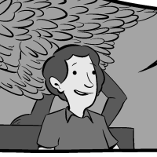
            </p>
            <p align="center">original image</p>
        </td>
        <td>
            <p align="center">
                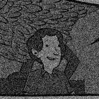
            </p>
            <p align="center">
                noisy image
            </p>
        </td>
    </tr>
</table>
</p>

<p align="center">
<table> 
<tr>
    <td>
        <p align="center">
            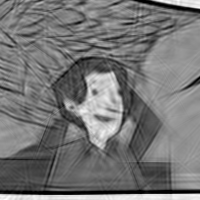
        </p>
        <p align="center">
            α=0
        </p>
    </td>
    <td>
        <p align="center">
            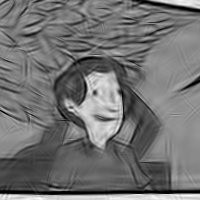
        </p>
        <p align="center">
            α=0.5
        </p>
    </td>
    <td>
        <p align="center">
            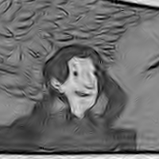
        </p>
        <p align="center">
            α=1
        </p>
    </td>
</tr> 
</table>
</p>


## <a name="sphere-valued"></a>The α-shearlet transform for functions defined on the sphere

As described in the technical report, we use a *chart-based* approach for computing the
α-shearlet transform of functions defined on the sphere. Precisely, we use the charts provided
by the [HEALPix](http://healpix.jpl.nasa.gov/) [pixelization](https://en.wikipedia.org/wiki/HEALPix) of the sphere,
which divides the sphere into 12 faces and provides cartesian charts for each of these faces. The crucial property
of this pixelization is that each pixel has exactly the same spherical area.

Now, given a function `f` defined on the sphere (in a discretized version, as a so-called **HEALPix map**), one can use
the function `get_all_faces()` from `SphereTransform.py` to obtain a family of 12 cartesian images, each of which
represents the function `f` restricted to one of the 12 faces of the sphere. As detailed in the technical report, analyzing
each of these 12 cartesian images and concatenating the coefficients is equivalent to analyzing `f` using the sphere-based
α-shearlets.

Conversely, one needs a way to reconstruct (a slightly modified version of) `f`, given the (possibly thresholded or
otherwise modified) α-shearlet coefficients. To this end, one first reconstructs each of the 12 cartesian images using
the usual α-shearlet transform and then concatenates these to obtain a function `g` defined on the sphere, via the
function `put_all_faces` defined in `SphereTransform.py`.

Here, we just briefly indicate how `put_all_faces` can be used to obtain a plot of certain (randomly selected)
α-shearlets on the sphere. Below, we use an alpha-shearlet system with 6 scales, but only use alpha-shearlets
from the first three scales for plotting, since the alpha-shearlets on higher scales are very small/short
and thus unsuitable for producing a nice plot.
```python
>>> import healpy as hp
>>> import numpy as np
>>> import matplotlib.pyplot as plt
>>> from SphereTransform import put_all_faces as Cartesian2Sphere
>>> from AlphaTransform import AlphaShearletTransform as AST

>>> width = height = 512
>>> alpha = 0.5
>>> num_scales = 6 # we use six scales, so that the shearlets on lower scales are big (good for plotting)

>>> trafo = AST(width, height, [alpha] * num_scales, real=True)
>>> all_shearlets = trafo.shearlets # get a list of all shearlets

>>> cartesian_faces = np.empty((12, height, width))
>>> # for each of the 12 faces, select a random shearlet from one of the first three scales
>>> upper_bound = trafo.scale_slice(3).start
>>> shearlet_indices = np.random.choice(np.arange(upper_bound), size=12, replace=False)
>>> for i, index in enumerate(shearlet_indices):
        cartesian_faces[i] = all_shearlets[index]
        # normalize, so that the different shearlets are comparable in size
        max_val = np.max(np.abs(cartesian_faces[i]))
        cartesian_faces[i] /= max_val

>>> # use HEALPix charts to push the 12 cartesian faces onto the sphere
>>> sphere_shearlets = Cartesian2Sphere(cartesian_faces)
>>> hp.mollview(sphere_shearlets, cbar=False, hold=True)
>>> plt.title(r"Random $\alpha$-shearlets on the sphere", fontsize=20)
>>> plt.show()
```

The above code produces a plot similar to the following:
<p align="center">
<a name="sphere-plot"></a>
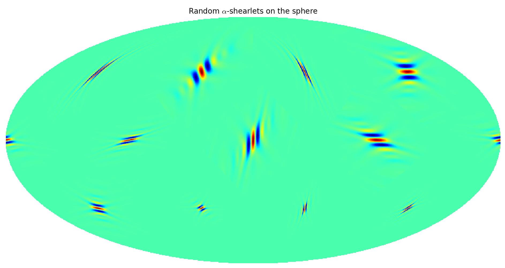
</p>


## Required packages

In addition to Python 3, the software requires the following Python packages:

* [numpy](http://www.numpy.org/)
* [matplotlib](http://matplotlib.org/)
* [numexpr](https://github.com/pydata/numexpr)
* [pyfftw](https://github.com/pyFFTW/pyFFTW)
* [tqdm](https://github.com/tqdm/tqdm)
* [healpy](https://github.com/healpy/healpy) (only required for [SphereTransform.py](./SphereTransform.py))
* [PIL](http://www.pythonware.com/products/pil/), the Python Imaging Library
* [scipy.ndimage](https://www.scipy.org/)
